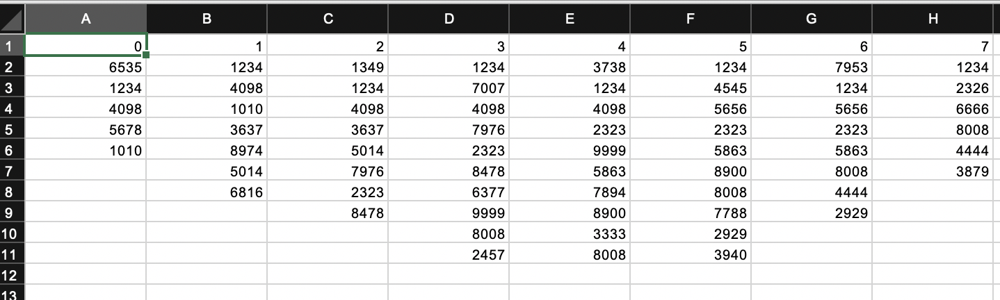
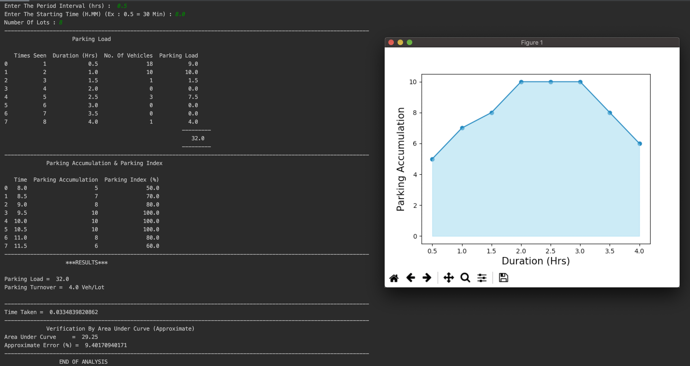

# Parking-Usage-Studies

**Author** : Nikhil Dandamudi

**Specialization** : Transportaion Engineering

**Description**    : Calculates The Parking Accumulation And Parking Index, Verifies By An Approximate Area Under Curve.

**Algorithm In Action** :

  **Input Given: Vehicle Number Plate Recorded Among Various Time Slots**

  **Result : Parking Accumilation, Parking Index, Approximate Area Verification**

